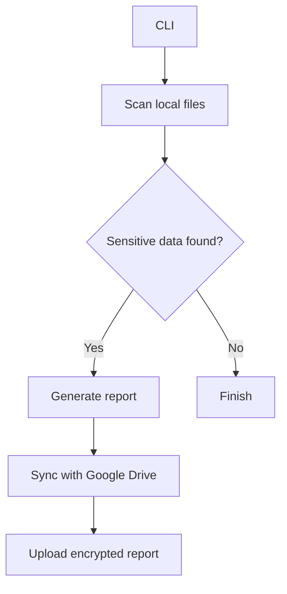

# Arquitectura

## Flujo de sincronización

```mermaid
flowchart TD
    A[CLI] --> B[Scan local files]

    B --> C{Sensitive data found?}

    C -->|Yes| D[Generate report]

    C -->|No| E[Finish]

    D --> F[Sync with Google Drive]

    F --> G[Upload encrypted report]
```